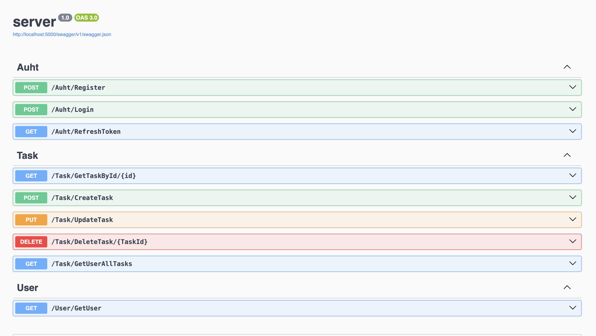
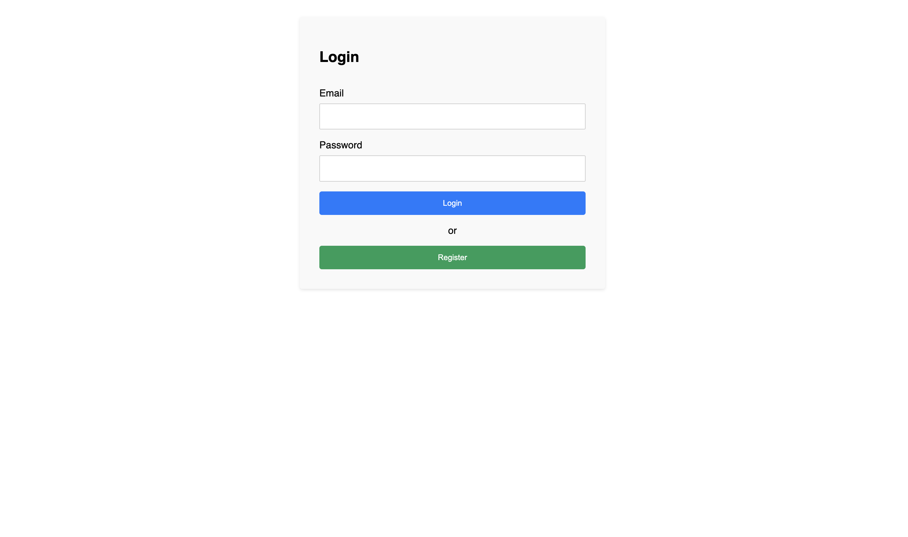
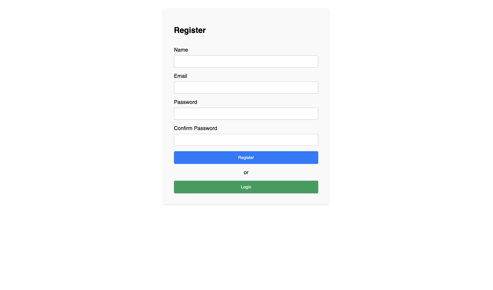
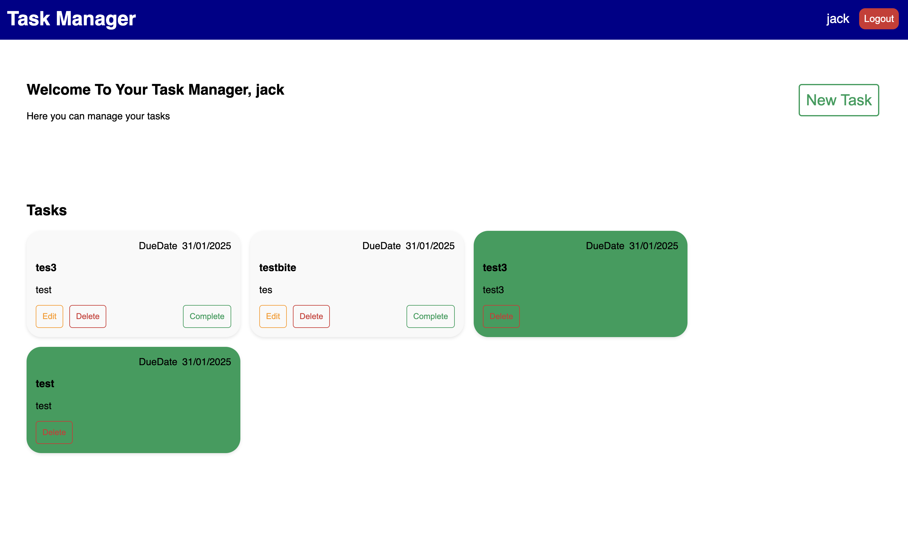

# Task Manager Application

This project is a **Task Manager** application built as part of a technical test for Axa. It showcases a full-stack implementation using **.NET**, **SQL Server**, and **Angular**.

## Features
- **User Authentication**: Login and register functionality with token-based authentication.
- **Task Management**:
  - Add, update, delete tasks.
  - Mark tasks as complete.
  - Display tasks in order of completion status.
- **Token Refresh**: Automatic token refresh for prolonged sessions.
- **Responsive Design**: User-friendly interface with Angular custom styling.

---

## Technologies Used
### Backend:
- **.NET Core**: For building a REST API.
- **SQL Server**: To manage and store task and user data.
- **Dapper**: For database access and manipulation.

### Frontend:
- **Angular**: For building the dynamic and responsive user interface.
- **RxJS**: To manage Toast.
- **SCSS**: For styling.


---

## Prerequisites
1. **Backend Requirements**:
   - .NET SDK installed (https://dotnet.microsoft.com/download).
   - SQL Server installed and configured (https://www.microsoft.com/en-us/sql-server/sql-server-downloads).

2. **Frontend Requirements**:
   - Node.js installed (https://nodejs.org).
   - Angular CLI installed globally:  
     ```bash
     npm install -g @angular/cli
     ```

3. **Database Setup**:
   - Ensure SQL Server is running.
   - Create a database and configure connection strings in the backend.

---

## Installation and Setup BackEnd
### Backend:
1. Clone the repository:
   ```bash
   git clone
2. Create a new Database SQL server
    Save the connection string for latter
3. User the SQL_AXA.sql file
    To set up the database affter creating a new one (You can use Azure data studio);
4. Configure the appsettings.json file:
    Update the ConnectionStrings section with your SQL Server details.
   cd ./server
5. Start the backend server:
   ```bash
    dotnet watch run
6. The sever should automatical open a window 
    in case it's not the case go to (http://localhost:5000/swagger)

## Installation and Setup FrontEnd
### FrontEnd:
2. Install packages
    ```bash
    npm install
3. Start the project
     ```bash
   ng serve
6. Open Browser
    go to link: (http://localhost:4200)

    # Usage

## Register a New User:
- Navigate to the `/register` page.
- Create an account to access the application.

## Login:
- Use the `/` (login) page to authenticate and gain access.

## Manage Tasks:
- Create, update, and delete tasks from the dashboard.
- Mark tasks as completed or manage their statuses.

## Token Management:
- The app automatically refreshes the token for authenticated users.

## Swagger display of all api routes
<p align="center">
  
</p>

## Login Page
<p align="center">
  
</p>

## Register Page
<p align="center">
  
</p>

## Home Page
<p align="center">
  
</p>
